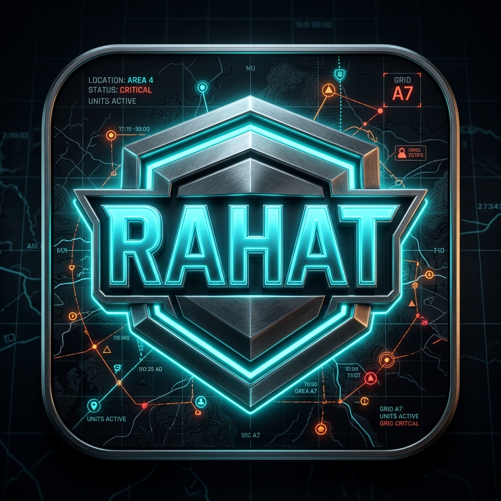

# RAHAT Backend — Crisis Intelligence API

<div align="center">


<br/>

**FastAPI + Google Antigravity + Gemini AI — 5-Agent Crisis Detection Pipeline**

[](https://fastapi.tiangolo.com)
[](https://python.org)
[](https://ai.google.dev)
[](https://antigravity.google.dev)
[](https://railway.app)

[🔗 Live API](YOUR_RAILWAY_URL) • [📱 Flutter App Repo](YOUR_FLUTTER_REPO) • [🎥 Demo Video](YOUR_DEMO_VIDEO)

</div>

---

## 🧠 Overview

This is the **AI backend** for RAHAT — Real-time Agentic Hazard & Action Tracker. It orchestrates **5 specialized Gemini AI agents** via Google Antigravity to transform unstructured crisis signals into coordinated emergency response actions.

One API call triggers a full 5-agent pipeline that:
1. Ingests multi-source signals (social, weather, traffic)
2. Detects and classifies the crisis
3. Extracts precise GPS coordinates
4. Plans coordinated response actions
5. Simulates execution with full audit trail

---

## 🚀 Live API

```
Base URL: YOUR_RAILWAY_URL

GET  /health          → System health check
GET  /status          → Pipeline status
POST /analyze         → Manual crisis analysis
POST /auto-scan       → Autonomous news scanning
GET  /pipeline-status → Check if pipeline is running
```

### Quick Test
```bash
# Health check
curl YOUR_RAILWAY_URL/health

# Manual analysis
curl -X POST YOUR_RAILWAY_URL/analyze \
  -H "Content-Type: application/json" \
  -d '{
    "inputs": [
      {"source": "social", "text": "G-10 mein pani bhar gaya hai"},
      {"source": "weather", "text": "Heavy rainfall alert Islamabad"},
      {"source": "traffic", "text": "Faizabad interchange blocked"}
    ]
  }'

# Auto scan live Pakistani news
curl -X POST YOUR_RAILWAY_URL/auto-scan
```

---

## 🤖 5-Agent Pipeline (Google Antigravity)

```
INPUT SIGNALS
     │
     ▼
┌────────────────────┐
│  Agent 1           │  📡 SIGNAL COLLECTOR
│  Gemini 1.5 Flash  │  • Processes Roman Urdu / Urdu / English
│                    │  • Extracts: location, crisis type, urgency
│                    │  • Normalizes to structured JSON
└────────┬───────────┘
         │ signals[]
         ▼
┌────────────────────┐
│  Agent 2           │  🔍 CRISIS DETECTOR
│  Gemini 1.5 Flash  │  • Clusters signals by location (2km radius)
│                    │  • Cross-references multiple sources
│                    │  • Assigns severity: CRITICAL/HIGH/MEDIUM/LOW
│                    │  • Calculates confidence percentage
└────────┬───────────┘
         │ crisis_event
         ▼
┌────────────────────┐
│  Agent 3           │  📍 LOCATION INTELLIGENCE
│  Gemini 1.5 Flash  │  • Extracts GPS coordinates from text
│                    │  • Maps sector names to lat/lng
│                    │  • Calculates affected radius
│                    │  • Recommends map zoom level
└────────┬───────────┘
         │ location_data
         ▼
┌────────────────────┐
│  Agent 4           │  📋 RESPONSE PLANNER
│  Gemini 1.5 Flash  │  • Generates 3-5 prioritized actions
│                    │  • Assigns: Rescue 1122, Traffic Police,
│                    │    NDMA, Notification Service, System
│                    │  • Pakistan-specific emergency context
└────────┬───────────┘
         │ response_plan
         ▼
┌────────────────────┐
│  Agent 5           │  ⚡ ACTION EXECUTOR
│  Gemini 1.5 Flash  │  • Simulates each action execution
│                    │  • Before → After state transformation
│                    │  • Generates audit trail
│                    │  • Creates report #RAHAT-XXXX
└────────┬───────────┘
         │
         ▼
    FULL PIPELINE RESULT
    (JSON with complete reasoning trace)
```

---

## 📁 Project Structure

```
backend/
├── main.py                      # FastAPI app + endpoints + CORS
│
├── agents/
│   ├── base.py                  # BaseAgent class (reasoning logger)
│   ├── signal_collector.py      # Agent 1 — signal extraction
│   ├── crisis_detector.py       # Agent 2 — crisis classification
│   ├── location_intelligence.py # Agent 3 — GPS coordinate extraction
│   ├── response_planner.py      # Agent 4 — action planning
│   └── action_executor.py       # Agent 5 — execution simulation
│
├── services/
│   ├── gemini_services.py       # Gemini API + pipeline orchestration
│   │                            # + API key rotation
│   │                            # + demo fallback responses
│   └── news_scanner.py          # RSS feed scraper (Dawn/Geo/ARY/Tribune)
│
├── models/
│   ├── signal.py                # Signal Pydantic model
│   ├── crisis.py                # CrisisEvent model
│   └── action.py                # ActionItem model
│
├── antigravity/
│   ├── .rules                   # Global agent behavior rules
│   ├── workflows/               # Reusable Antigravity commands
│   └── skills/                  # Domain knowledge files
│
├── Dockerfile                   # Container config for deployment
├── requirements.txt
└── .env.example                 # Environment variables template
```

---

## 🔑 Google Antigravity Configuration

### `.rules` File
The `.rules` file gives Antigravity global context about the project:
```
# RAHAT Project Rules
- All agents must return structured JSON with reasoning_steps[]
- Use Pakistani emergency services: Rescue 1122, Police 15, Edhi
- Reference real Islamabad sectors: G-10, F-8, I-8, Faizabad
- Support: English, Roman Urdu, Urdu inputs
- Every agent decision must be traceable and explainable
```

### Skills
```
skills/crisis-domain/SKILL.md    ← Severity levels, action templates
skills/pakistan-context/SKILL.md ← Local geography, emergency numbers
```

### Workflows
```
/run-pipeline     ← Triggers full 5-agent test run
/scaffold-agent   ← Creates new agent with correct structure
/generate-mock    ← Generates test scenarios
```

---

## 📡 API Reference

### POST /analyze

Manual crisis analysis from user-provided inputs.

**Request:**
```json
{
  "inputs": [
    {"source": "social", "text": "G-10 mein pani bhar gaya"},
    {"source": "weather", "text": "Heavy rain warning Islamabad"},
    {"source": "traffic", "text": "Faizabad completely blocked"}
  ]
}
```

**Response:**
```json
{
  "status": "success",
  "pipeline_results": {
    "signal_collector": {
      "signals": [...],
      "reasoning_steps": [
        "Analyzing 3 multi-modal input sources",
        "Detected Roman Urdu flood indicators",
        "Location extracted: G-10 Markaz"
      ]
    },
    "crisis_detector": {
      "crisis_event": {
        "location": "G-10 Markaz, Islamabad",
        "crisis_type": "Urban Flooding",
        "severity": "HIGH",
        "confidence": 95,
        "situation_summary": "...",
        "affected_population": "Est. 15,000"
      },
      "reasoning_steps": [...]
    },
    "location_intelligence": {
      "location_data": {
        "primary_location": {
          "name": "G-10 Markaz",
          "latitude": 33.6751,
          "longitude": 73.0479,
          "zoom_level": 15
        },
        "affected_zones": [...],
        "coverage_radius_km": 3.0
      }
    },
    "response_planner": {
      "response_plan": {
        "actions": [
          {
            "id": "ACT-001",
            "title": "Deploy Rescue Boats to G-10 Markaz",
            "resource": "Rescue 1122",
            "priority": "Critical",
            "description": "..."
          }
        ],
        "expected_outcome": "..."
      }
    },
    "action_executor": {
      "execution_report": {
        "executed_actions": [...],
        "system_state_before": {...},
        "system_state_after": {...},
        "audit_log": [
          "10:15:04 - Rescue 1122 dispatched to G-10 Markaz",
          "10:15:05 - Traffic diversions active at Faizabad",
          "10:15:06 - 12,450 citizens notified via SMS",
          "10:15:07 - Report #RAHAT-7842 generated"
        ]
      }
    }
  }
}
```

---

### POST /auto-scan

Autonomously scans Pakistani news RSS feeds for crisis signals.

**Sources scanned:**
- Dawn News (`dawn.com/feeds/home`)
- Geo News (`geo.tv/rss`)
- ARY News (`arynews.tv/feed`)
- Express Tribune (`tribune.com.pk/feed`)

**Response includes:**
```json
{
  "status": "crisis_detected_and_processed",
  "scan_summary": {
    "scanned_sources": ["Dawn", "Geo", "ARY", "Express Tribune"],
    "total_articles_scanned": 332,
    "signals_extracted": 3,
    "using_demo_data": false
  },
  "pipeline_result": { ... }
}
```

---

## ⚙️ Local Development

### Prerequisites
- Python 3.11+
- Gemini API key from [Google AI Studio](https://aistudio.google.com)

### Setup
```bash
# Clone
git clone https://github.com/YOUR_USERNAME/rahat-backend.git
cd rahat-backend

# Virtual environment
python -m venv venv
source venv/bin/activate

# Install dependencies
pip install -r requirements.txt

# Configure environment
cp .env.example .env
nano .env  # Add your Gemini API keys
```

### `.env` Structure
```env
GEMINI_API_KEY_1=AIzaSy...
GEMINI_API_KEY_2=AIzaSy...  # Optional backup keys
GEMINI_API_KEY_3=AIzaSy...  # For key rotation
```

### Run
```bash
uvicorn main:app --reload --host 0.0.0.0 --port 8000
```

### Test Endpoints
```bash
# Health
curl http://localhost:8000/health

# Full pipeline
curl -X POST http://localhost:8000/analyze \
  -H "Content-Type: application/json" \
  -d '{"inputs": [{"source": "social", "text": "Fire at F-8 market!"}]}'

# Auto scan
curl -X POST http://localhost:8000/auto-scan
```

---

## 🛡️ Reliability Features

### API Key Rotation
```python
# Automatically rotates between multiple Gemini keys
# when one hits rate limits (429 errors)
GEMINI_API_KEY_1 = primary key
GEMINI_API_KEY_2 = fallback key  
GEMINI_API_KEY_3 = second fallback
```

### Smart Retry Logic
```python
# Extracts exact wait time from 429 error message
# Retries with correct delay automatically
retry_delay = extract_from_error(e) + 3  # seconds
```

### Pipeline Lock
```python
# Prevents concurrent pipeline runs
# Returns 429 if pipeline already running
pipeline_running = False  # global lock
```

### Demo Fallback
```python
# If all API keys exhausted, returns
# realistic pre-built Pakistan crisis scenario
# Demo always works regardless of quota
```

---

## 📊 Agent Prompt Design

Each agent has a carefully crafted system prompt. Example — Crisis Detector:

```
You are the Crisis Detector agent for RAHAT crisis system
in Islamabad/Rawalpindi, Pakistan.

You receive an array of Signal objects from the Signal Collector.

Your job:
1. Cluster signals by location (within 2km radius = same cluster)
2. Cross-reference signal types for corroboration
3. Assess severity: CRITICAL / HIGH / MEDIUM / LOW
4. Calculate confidence percentage (0-100)
5. Write situation summary in plain English

Think step by step. Show clustering logic explicitly.
Show why confidence is what it is.

Return a SINGLE JSON object (not an array):
{
  "location": "specific sector name",
  "crisis_type": "descriptive type",
  "severity": "HIGH",
  "confidence": 87,
  "situation_summary": "...",
  "affected_population": "Est. X people",
  "reasoning_steps": ["Step 1: ...", "Step 2: ..."]
}
```

---

## 🌍 Pakistan-Specific Intelligence

The agents are trained with Pakistani emergency context:

| Category | Examples |
|---|---|
| Emergency Services | Rescue 1122, Police 15, Edhi Foundation, NDMA, PDMA |
| Islamabad Sectors | G-10, G-11, F-8, F-7, I-8, Blue Area, Faizabad |
| Rawalpindi Areas | Saddar, Raja Bazaar, Committee Chowk, Murree Road |
| Hospitals | PIMS, Shifa International, Holy Family, KRL, Polyclinic |
| Roads | Srinagar Highway, IJP Road, Murree Road, Islamabad Expressway |
| News Sources | Dawn, Geo, ARY, Express Tribune, Pakistan Today |
| Languages | English, Roman Urdu, Urdu |

---

## 🐳 Docker Deployment

```bash
# Build
docker build -t rahat-backend .

# Run
docker run -p 8080:8080 \
  -e GEMINI_API_KEY_1=your_key \
  rahat-backend
```

---

## 📈 Performance

| Metric | Value |
|---|---|
| Average pipeline time | 15-25 seconds |
| Gemini calls per request | 5 (one per agent) |
| Free tier limit | 20 req/day (Gemini 2.5 Flash) |
| With key rotation | 60-80 req/day |
| Concurrent requests | 1 (pipeline lock) |
| News sources scanned | 4 (332+ articles) |

---

## 🔗 Related

- **Flutter App:** [YOUR_FLUTTER_REPO](YOUR_FLUTTER_REPO)
- **Demo Video:** [YouTube](YOUR_DEMO_VIDEO)
- **Live API:** [YOUR_RAILWAY_URL](YOUR_RAILWAY_URL)
- **Google Antigravity:** [antigravity.google.dev](https://antigravity.google.dev)

---

## 📄 License

MIT License — see [LICENSE](LICENSE) for details.

---

<div align="center">

**RAHAT Backend — Powering Crisis Intelligence for Pakistan 🇵🇰**

*Built with Google Antigravity + Gemini AI for the Google Antigravity Hackathon 2026*

</div>
